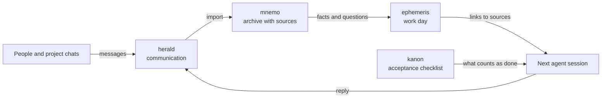

  

  <a href="https://zenonel.github.io"><strong>Portfolio</strong></a>
  · <a href="./README_RU.md">Русский</a>
  · <a href="https://github.com/ZenonEl?tab=repositories">Repositories</a>

Backend engineer. I take services to production: payments, receipts, delivery,
banks and LLM features. In 2026, working with AI agents, I took an online store
from requirements to 101 orders before its official launch. I write mostly in
Python and pick up another stack when the task needs it. Agents write the code;
the decisions and the result are mine.

## What I built

### [mnemo](https://github.com/ZenonEl/mnemo)

Project requirements arrive in pieces: messages, documents, screenshots,
corrections. mnemo keeps that material in a local archive and remembers, for
each piece, where it came from, when and from whom, and which requirement,
decision or question it belongs to. An agent in Claude Code or Codex goes back
to the source instead of a retelling. A 27-rule linter and 126 tests check the
archive.

`Python` · `Claude Code and Codex plugin` · `AGPL-3.0 / CC BY-SA 4.0`

### [herald](https://github.com/ZenonEl/herald)

herald connects an agent session to Telegram. Incoming messages and files reach
the session, and the agent sends replies only along allowed routes. I can write
to an open session straight from the bot.

`Python` · `MCP` · `192 tests` · `AGPL-3.0`

### [ephemeris](https://github.com/ZenonEl/ephemeris)

ephemeris keeps a work day in one GitHub issue. When an agent session ends, the
next one gets addresses instead of a retelling: comments, commits, paths and
links into the mnemo archive. 236 work dailies have been kept this way since May.

`Markdown` · `GitHub CLI` · `Claude Code and Codex plugin`

### [kanon](https://github.com/ZenonEl/kanon)

Before work starts, kanon turns a task into a checklist of observable results
and the proof each one needs. An item closes when proof is inserted; a tick is
not enough. A 61-check self-test, CI green.

`Python` · `Claude Code hooks` · `Codex`

### [TelegramMediaRelayBot](https://github.com/ZenonEl/TelegramMediaRelayBot)

A self-hosted .NET Telegram bot that downloads videos and images from a link and
forwards them to contacts by their privacy rules. Its own Bot API server lets
files up to 2 GB through, the download queue survives a restart, and 34 unit
tests run in CI. It is my main public C# project.

`C#` · `.NET 10` · `Docker` · `AGPL-3.0`

## How the tools work together

## More projects

- [zapret2-nix](https://github.com/ZenonEl/zapret2-nix): a NixOS module and presets for zapret2; the strategy switches on a running machine without a rebuild.
- [CrabVoice](https://github.com/ZenonEl/CrabVoice): a Tauri app that plays a synchronised voice-over on top of online video; v1.0.0 in eleven days.
- [RemoteGamepad](https://github.com/ZenonEl/RemoteGamepad): a phone as a wireless Xbox 360 gamepad for Linux games.
- [OwlWhisper](https://github.com/ZenonEl/OwlWhisper): a serverless P2P messenger in Go, stopped at MVP when the cost of making it safe became clear.
- [HeartRender](https://github.com/ZenonEl/HeartRender): heart-rate data from Gadgetbridge turned into a printable PDF.

## How I check the work

AI agents write most of the code. A change stays a draft until subagent
reviewers have checked it and I have run it live against the requirements. The
public repositories have tests and CI, and their READMEs record known limits and
the approaches I dropped.

- [mnemo standard and integrity rules](https://github.com/ZenonEl/mnemo/tree/main/SPEC)
- [herald tests](https://github.com/ZenonEl/herald/tree/main/tests)
- [TelegramMediaRelayBot CI](https://github.com/ZenonEl/TelegramMediaRelayBot/actions)

## Portfolio

The [site](https://zenonel.github.io) has five anonymised cases from 2026 with
their numbers, project pages and a CV.
