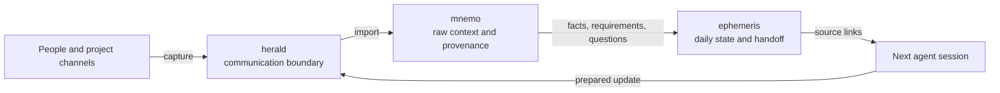

  

  <a href="https://zenonel.github.io"><strong>Portfolio</strong></a>
  · <a href="./README_RU.md">Русский</a>
  · <a href="https://github.com/ZenonEl?tab=repositories">Repositories</a>

I build backend systems and the tools around them, from product APIs and data
pipelines to agent-facing workflows that keep requirements traceable. Most of
my commercial work is in Python, but I choose the stack around the problem. AI
agents help with analysis and implementation; design decisions, verification,
and the result remain my responsibility.

## What I build

### [mnemo](https://github.com/ZenonEl/mnemo)

Project requirements rarely arrive as clean tickets. They emerge from project
channels, documents, screenshots, feedback, and later corrections. Mnemo keeps
that raw material together with its source, date, attribution, and links to
requirements, decisions, and open questions. A 27-rule linter and 126 tests
check the archive; a separate self-check compares the published standard with its
implementation.

`Python` · `Claude Code and Codex plugin` · `AGPL-3.0 / CC BY-SA 4.0`

### [herald](https://github.com/ZenonEl/herald)

Herald handles the live edge of the same workflow. It captures incoming
messages and files into a local buffer for later import into mnemo, and sends
agent-prepared updates through configured communication routes. It moves
material between people and agents without becoming a second archive.

`Python` · `MCP` · `192 tests` · `AGPL-3.0`

### [TelegramMediaRelayBot](https://github.com/ZenonEl/TelegramMediaRelayBot)

A self-hosted .NET media relay outside the agent-tooling stack. It combines a
local Bot API server, modular downloaders, and a persistent queue; files up to
2 GB are supported, and 34 unit tests run in CI. This project is the clearest
public example of my C#/.NET work.

`C#` · `.NET 10` · `Docker` · `AGPL-3.0`

## How the AI workflow connects

Each tool has a narrow role. Mnemo keeps durable evidence, Herald handles
communication, and [Ephemeris](https://github.com/ZenonEl/ephemeris) records the
state of the day in GitHub issues. A handoff passes addresses to source material
instead of rewriting the same context for the next session.

## Engineering practice

I use versioned formats, CI, automated tests, manual critical-path checks, and
small reviewable changes. Public repositories also document known limits and
discarded approaches. AI agents write most of the code. It stays a draft until
it has passed subagent review until LGTM and I have checked its behaviour by
hand and in live runs against the requirements.

- [Mnemo standard and integrity rules](https://github.com/ZenonEl/mnemo/tree/main/SPEC)
- [Herald test suite](https://github.com/ZenonEl/herald/tree/main/tests)
- [TelegramMediaRelayBot CI](https://github.com/ZenonEl/TelegramMediaRelayBot/actions)

## Portfolio

The [site](https://zenonel.github.io) is the visual companion to this profile:
project pages, screenshots, downloads, and the longer stories that do not fit in
a repository card. It currently covers my earlier desktop projects; the next
revision will add the engineering case studies behind the work above.
