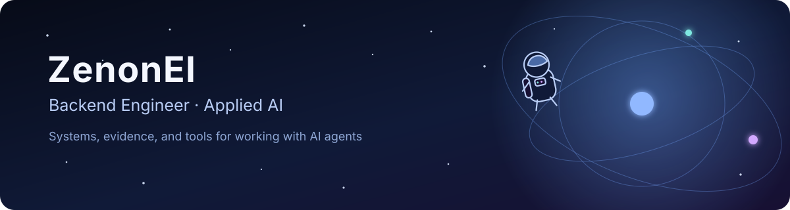
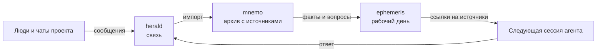

  

  <a href="https://zenonel.github.io"><strong>Портфолио</strong></a>
  · <a href="./README.md">English</a>
  · <a href="https://github.com/ZenonEl?tab=repositories">Репозитории</a>

Бэкенд-разработчик. Довожу сервисы до прода: платежи, чеки, доставка, банки и
функции на LLM. В 2026 году с AI-агентами довёл интернет-магазин от требований
до 101 заказа ещё до официального запуска. Пишу в основном на Python, другой
стек беру, когда его требует задача. Код пишут агенты, решения и ответственность
за результат на мне.

## Что я сделал

### [mnemo](https://github.com/ZenonEl/mnemo)

Требования к проекту приходят по кускам: переписка, документы, скриншоты,
правки. mnemo складывает этот материал в локальный архив и для каждого куска
помнит, откуда он, когда и от кого пришёл и к какому требованию, решению или
вопросу относится. Агент в Claude Code или Codex возвращается к источнику, а не к
пересказу. Архив проверяют линтер из 27 правил и 126 тестов.

`Python` · `плагин Claude Code и Codex` · `AGPL-3.0 / CC BY-SA 4.0`

### [herald](https://github.com/ZenonEl/herald)

herald связывает сессию агента с Telegram. Входящие сообщения и файлы попадают
в сессию, а ответы агент отправляет только по разрешённым маршрутам. Открытой
сессии можно написать прямо из бота.

`Python` · `MCP` · `192 теста` · `AGPL-3.0`

### [TelegramMediaRelayBot](https://github.com/ZenonEl/TelegramMediaRelayBot)

Self-hosted Telegram-бот на .NET: скачивает видео и картинки по ссылке и
пересылает их контактам по их правилам приватности. Свой сервер Bot API
пропускает файлы до 2 ГБ, очередь загрузок переживает перезапуск, 34 unit-теста
идут в CI. Это мой основной публичный проект на C#.

`C#` · `.NET 10` · `Docker` · `AGPL-3.0`

## Как инструменты работают вместе

mnemo хранит, herald связывает с людьми, а
[ephemeris](https://github.com/ZenonEl/ephemeris) ведёт рабочий день в одном
GitHub issue. Когда сессия заканчивается, следующая получает ссылки на исходники,
а не пересказ.

## Как я проверяю работу

Большую часть кода пишут AI-агенты. Изменение остаётся черновиком, пока его не
проверят сабагенты-ревьюеры и пока я сам не прогоню его вживую по требованиям.
В публичных репозиториях есть тесты и CI, а в README записаны известные
ограничения и варианты, от которых я отказался.

- [Стандарт mnemo и правила целостности](https://github.com/ZenonEl/mnemo/tree/main/SPEC)
- [Тесты herald](https://github.com/ZenonEl/herald/tree/main/tests)
- [CI TelegramMediaRelayBot](https://github.com/ZenonEl/TelegramMediaRelayBot/actions)

## Портфолио

На [сайте](https://zenonel.github.io/ru/) пять обезличенных кейсов 2026 года с
цифрами, страницы проектов и резюме.
