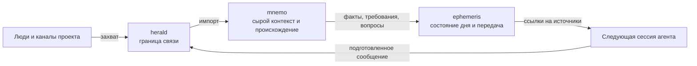

  

  <a href="https://zenonel.github.io"><strong>Портфолио</strong></a>
  · <a href="./README.md">English</a>
  · <a href="https://github.com/ZenonEl?tab=repositories">Репозитории</a>

Я разрабатываю бэкенд-системы и инструменты вокруг них: продуктовые API,
пайплайны данных и рабочие процессы для AI-агентов, в которых требования можно
проследить до источника. В коммерческой работе чаще всего использую Python, но
стек выбираю под задачу. AI-агенты помогают с анализом и реализацией, а решения,
проверка и итоговый результат остаются моей ответственностью.

## Что я разрабатываю

### [mnemo](https://github.com/ZenonEl/mnemo)

Требования к проекту редко приходят в виде готовых задач. Они складываются из
переписки, документов, скриншотов, обратной связи и последующих исправлений.
Mnemo хранит исходный материал вместе с источником, датой, авторством и связями
с требованиями, решениями и открытыми вопросами. Линтер из 27 правил и 126 тестов
проверяют архив, а отдельный self-check сравнивает опубликованный стандарт с реализацией.

`Python` · `плагин Claude Code и Codex` · `AGPL-3.0 / CC BY-SA 4.0`

### [herald](https://github.com/ZenonEl/herald)

Herald работает на оперативной границе этого процесса. Он принимает сообщения
и файлы во временный локальный буфер для последующего импорта в mnemo, а также
отправляет подготовленные агентом сообщения через настроенные каналы связи.
Herald передаёт материал между людьми и агентами, но не становится вторым
архивом.

`Python` · `MCP` · `192 теста` · `AGPL-3.0`

### [TelegramMediaRelayBot](https://github.com/ZenonEl/TelegramMediaRelayBot)

Self-hosted медиашлюз на .NET, не связанный с AI-инструментами. В нём есть
локальный Bot API server, модульные загрузчики и персистентная очередь. Бот
поддерживает файлы до 2 ГБ, а 34 unit-теста выполняются в CI. Это мой основной
публичный проект на C#/.NET.

`C#` · `.NET 10` · `Docker` · `AGPL-3.0`

## Как связан рабочий контур с AI

У каждого инструмента своя узкая роль. Mnemo хранит подтверждающие материалы,
Herald отвечает за связь, а [Ephemeris](https://github.com/ZenonEl/ephemeris)
фиксирует состояние дня в GitHub issues. При передаче следующая сессия получает
адреса исходных материалов вместо очередного пересказа того же контекста.

## Инженерная практика

Я использую версионируемые форматы, CI, автоматические тесты, ручные проверки
критических сценариев и небольшие изменения, которые удобно ревьюить. В
публичных репозиториях также записываю известные ограничения и отброшенные
подходы. Большую часть кода пишут AI-агенты. Он остаётся черновиком, пока не
пройдёт ревью сабагентами до LGTM и пока я не проверю его поведение руками и
живыми прогонами по требованиям.

- [Стандарт Mnemo и правила целостности](https://github.com/ZenonEl/mnemo/tree/main/SPEC)
- [Тесты Herald](https://github.com/ZenonEl/herald/tree/main/tests)
- [CI TelegramMediaRelayBot](https://github.com/ZenonEl/TelegramMediaRelayBot/actions)

## Портфолио

[Сайт](https://zenonel.github.io) дополняет GitHub страницами проектов,
скриншотами, загрузками и подробными историями, которые не помещаются в карточку
репозитория. Сейчас на нём представлены мои ранние desktop-проекты. В следующей
версии появятся инженерные кейсы по работам выше.
